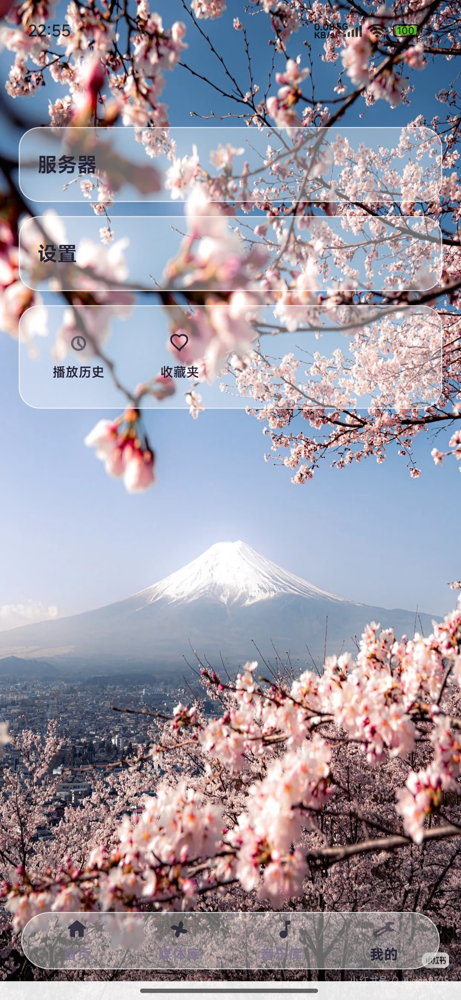
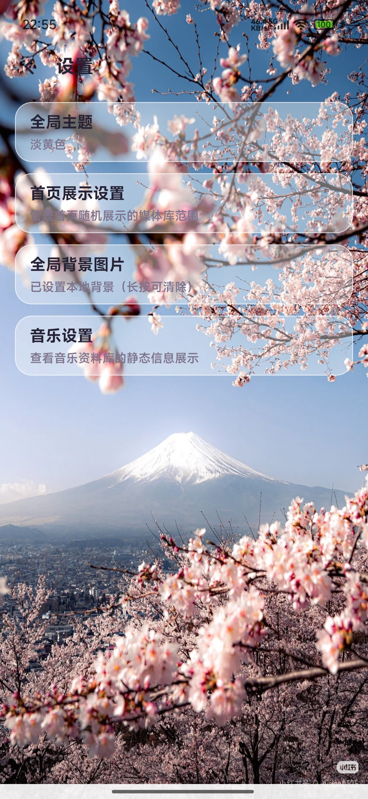
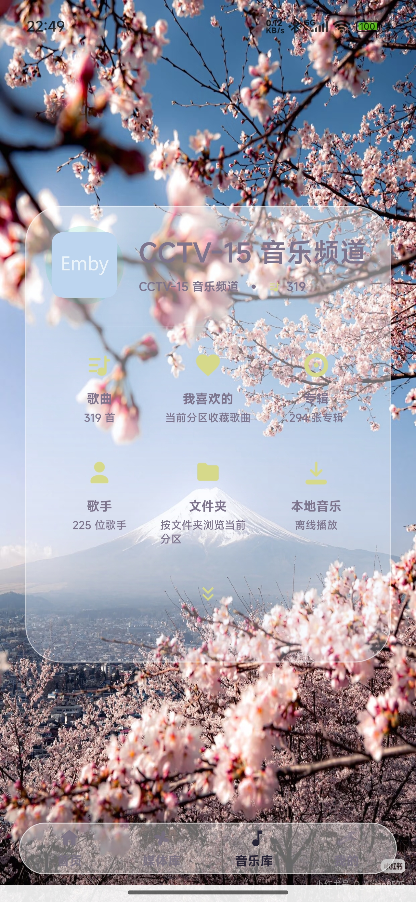
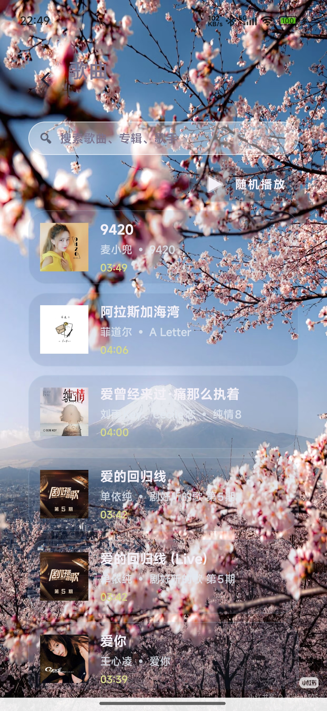
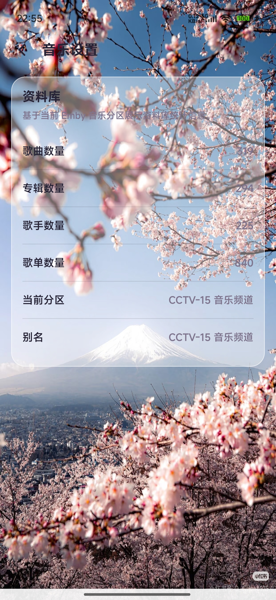

# EmbyPro

EmbyPro 是一个基于 Emby 官方开放 API 开发的 Android 第三方客户端，目标是提供更完整、更顺手、也更适合移动端沉浸式使用的 Emby 体验。

项目围绕以下方向持续迭代：

- 更流畅的媒体浏览与播放体验
- 更适合手机端的交互与视觉风格
- 更完善的音乐、视频、本地缓存与历史能力
- 更接近原生 App 的连续观看与沉浸式操作体验

## 截图预览

<p align="center">
  
  
  
</p>

<p align="center">
  
  
  
</p>

## 项目特点

- 基于 Emby 官方 API 实现服务器连接、登录、媒体库读取、详情页、收藏、播放进度同步等能力
- 支持服务器管理，包括添加、编辑、重新登录、修改密码等操作
- 支持媒体库浏览、继续观看、收藏、历史、本地缓存等常用场景
- 支持视频详情页动态取色、沉浸式播放器交互与连续播放体验
- 支持音乐分区、本地音乐、歌词展示、缓存与离线播放能力
- 支持深色 / 浅色风格适配，以及统一化弹窗与界面视觉

## 核心亮点

### 连续观看体验

- 支持视频连播
- 支持播放器内上下切换视频
- 支持预缓存后续内容，减少切换等待
- 从播放器返回时，尽量回到当前实际播放条目的详情页

### 音乐能力增强

- 支持音乐分区切换
- 支持本地音乐与离线播放
- 支持歌词解析与歌词页展示
- 支持缓存音频时同步缓存歌词
- 支持歌曲列表、收藏、历史等音乐场景扩展

### 移动端交互优化

- 自定义播放器手势
- 统一风格的弹窗、选择卡和操作面板
- 更偏 App 化的页面结构与视觉层级
- 更适合单手操作的按钮布局与交互方式

## 已实现功能

- Emby 服务器连接与登录
- 用户头像拉取与头像修改
- 首页与媒体库浏览
- 视频详情页与播放器
- 播放历史与收藏
- 播放进度同步与继续播放
- 音乐库、音乐列表、音乐播放器
- 本地音乐缓存与离线播放
- 歌词展示与歌词跟随
- 本地图片 / 封面缓存
- 统一主题与动态取色界面

## 技术栈

- Kotlin
- Android 原生开发
- Media3 / ExoPlayer
- Emby REST API
- 本地缓存与会话持久化

## 项目结构

```text
app/
  src/main/java/com/liujiaming/embypro/   主要业务代码
  src/main/res/                           布局、图片、字符串、主题资源
  images/                                 README 展示截图
```

## 开发说明

### 环境要求

- Android Studio
- JDK 17 或项目当前 Gradle 配置要求的版本
- 可用的 Emby 服务端

### 本地构建

```bash
./gradlew :app:assembleDebug
```

Windows:

```bash
gradlew.bat :app:assembleDebug
```

## 项目目标

EmbyPro 不只是一个“能看”的 Emby 客户端，而是想做一个更适合移动端长时间使用、连续播放、沉浸式操作的 Android 客户端。

后续会继续围绕这些方向优化：

- 更完整的播放器能力
- 更稳定的播放与会话同步
- 更统一的页面与弹窗设计
- 更完善的音乐与离线能力

## 说明

本项目为个人开发与持续迭代中的客户端项目，部分能力仍会继续优化与补全。
